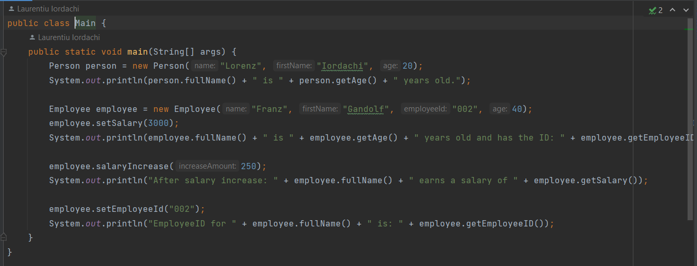

<a name="readme-top"></a>
# JavaAufgabe
Meine erste Java Aufgabe 2023 <br>
Author: Iordachi Laurentiu <br>
LBS Eibiswald | 2aAPC

Nur eine Demo Anwendung...<br>
Hier könnte die Anwendung erklärt werden...

## Installation

```cmd

git checkout origin/master

```
<p align="right">(<a href="#readme-top">back to top</a>)</p>

## Verwendung
Technologien im Einsatz:
[![Java][java.com]][java-url]

```php

//some source code configuration

```
<p align="right">(<a href="#readme-top">back to top</a>)</p>

## Screenshots




<p align="right">(<a href="#readme-top">back to top</a>)</p>

## License

[MIT](https://choosealicense.com/licenses/mit/)
<p align="right">(<a href="#readme-top">back to top</a>)</p>

<!-- MARKDOWN LINKS & IMAGES -->
<!-- https://www.markdownguide.org/basic-syntax/#reference-style-links -->
[java.com]: https://img.shields.io/badge/Java-ED8B00?style=for-the-badge&logo=openjdk&logoColor=white
[java-url]: https://www.java.com/de/

